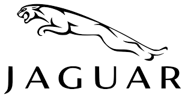

<html lang="ru">
<head>
    <meta charset="UTF-8">
    <meta name="viewport" content="width=device-width, initial-scale=1.0">
    <title>Сравнение автомобилей Lamborghini, Voyah и Jaguar</title>
    
</head>
<body>
    

        <header>
            <h1>Сравнение автомобилей</h1>
            
Lamborghini, Voyah и Jaguar

        </header>
        
        

            

                
            

            

                
            

            

                
            

        

        
        

            <table>
                <caption>Основные характеристики автомобилей</caption>
                <thead>
                    <tr>
                        <th>Характеристика</th>
                        <th>Lamborghini Revuelto</th>
                        <th>Voyah Free</th>
                        <th>Jaguar F-Type</th>
                    </tr>
                </thead>
                <tbody>
                    <tr>
                        <td>Двигатель</td>
                        <td>Гибридный (V12 + электромотор)</td>
                        <td>Электрический / гибридный</td>
                        <td>Бензиновый (V8)</td>
                    </tr>
                    <tr>
                        <td>Расход топлива (л/100 км)</td>
                        <td>11.0</td>
                        <td>1.5 (гибрид)</td>
                        <td>10.7</td>
                    </tr>
                    <tr>
                        <td>Тип КПП</td>
                        <td>Роботизированная</td>
                        <td>Автоматическая</td>
                        <td>Автоматическая</td>
                    </tr>
                    <tr>
                        <td>Количество передач</td>
                        <td>8</td>
                        <td>7</td>
                        <td>8</td>
                    </tr>
                    <tr>
                        <td>Максимальная скорость (км/ч)</td>
                        <td><mark>350</mark></td>
                        <td>200</td>
                        <td>285</td>
                    </tr>
                    <tr>
                        <td>Разгон 0–100 км/ч</td>
                        <td>2.5 c</td>
                        <td>4.8 c</td>
                        <td>4.4 c</td>
                    </tr>
                    <tr>
                        <td>Гарантийный срок</td>
                        <td>3 года</td>
                        <td>5 лет</td>
                        <td>3 года</td>
                    </tr>
                    <tr>
                        <td>Наличие экологических сертификатов</td>
                        <td>Euro 6</td>
                        <td><mark>EV / Zero Emission</mark></td>
                        <td>Euro 6</td>
                    </tr>
                    <tr>
                        <td>Начальная цена (евро)</td>
                        <td><mark>≈ 500 000</mark></td>
                        <td>≈ 70 000</td>
                        <td>≈ 85 000</td>
                    </tr>
                </tbody>
                <tfoot>
                    <tr>
                        <td>Итоги</td>
                        <td>Самая дорогая и быстрая модель</td>
                        <td>Самая экологичная и доступная</td>
                        <td>Классический спортивный стиль</td>
                    </tr>
                </tfoot>
            </table>
        

        
        

            

                

                    
                

                

                    <h3>Lamborghini Revuelto Суперкар</h3>
                    
Revuelto глубоко чтит традиции Lamborghini и открывает новую эру также и в плане своего внешнего дизайна. В то время как силуэт автомобиля следует культовой единой центральной направляющей, четкие линии и плавные отрицательные радиусы создают хай-тек форму, благодаря которой Revuelto можно безошибочно отнести к новому поколению суперкаров Lamborghini. Культовый V-образный 12-цилиндровый двигатель очень хорошо заметен сзади.

                    <a href="https://www.lamborghini.com/ru-en/модели/revuelto#val-ht" class="car-link" target="_blank">Официальный сайт</a>
                

            

            
            

                

                    
                

                

                    <h3>Voyah Free Электромобиль</h3>
                    
Voyah Free — это полноразмерный люксовый кроссовер, выпускаемый китайской дочерней компанией Dongfeng под премиальным брендом Voyah, доступный как в полностью электрической (EV), так и в гибридной (E-REV) версиях. Автомобиль предлагает мощную динамику, полный привод, роскошный интерьер, пневматическую подвеску с регулируемым клиренсом и современные технологии, такие как адаптивный круиз-контроль, а также интегрированное мобильное приложение для управления функциями автомобиля.

                    <a href="https://voyah.su/voyah-free" class="car-link" target="_blank">Официальный сайт</a>
                

            

            
            

                

                    
                

                

                    <h3>Jaguar F-Type Спорткар</h3>
                    
Jaguar F-Type — это британский двухдверный двухместный спортивный автомобиль, выпускавшийся с 2013 по 2024 год, представляющий собой "духовного наследника" легендарного E-Type. Автомобиль предлагает динамику благодаря мощным двигателям V8 и 4-цилиндровым агрегатам, а также роскошный дизайн с плавными линиями кузова и алюминиевым кузовом. F-Type доступен в кузовах купе и кабриолет, с задним или полным приводом, и предлагает широкий диапазон характеристик, от 300 до 575 л.с., в зависимости от комплектации.

                    <a href="https://www.jaguar.com/jaguar-range/f-type/index.html" class="car-link" target="_blank">Официальный сайт</a>
                

            

        

        
        <footer>
            
© 2025 Сравнение автомобилей. Все права защищены.

        </footer>
    

</body>
</html>
